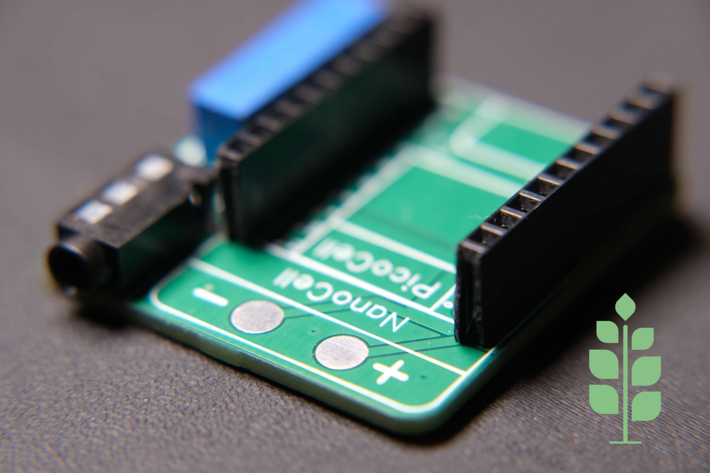

# 🌿 Sprig Labs – Sap AC Measurement Expansion Board

**Sap** is a compact and modular **AC current measurement expansion board** designed for non-invasive power monitoring in smart home and IoT applications. It is part of the **SprigStack ecosystem**, a collection of modular, stackable PCBs centered around the [**Sprig-C3 ESP32 Development Board**](https://www.tindie.com/products/34523/).

## 🔌 What It Does

Sap allows you to measure real-time AC current consumption from household or industrial appliances using a **Current Transformer (CT) sensor**—such as the [SCT-013](https://www.amazon.co.uk/Fasizi-SCT-013-000-Non-invasive-Current-Transformer/dp/B09Z2B45GM/ref=sr_1_2?crid=25SGPUVENY7VB&dib=eyJ2IjoiMSJ9.w-cbe5-H1OvdnaZ3JYhX_udTqawiWXQ7g_zBhRvYyum0J2LJb93OQBQcvh25cdQgps3U0MQ6BqyqACU7XsfYUZlBgwTWCCq0V8Yqo5bX7EzDb_wnuGEKPnF4lvi-wAhtevLMF7XYyPmsCKa5s2mbCvgT6TuNeIcylwKTXPcIiIcwNiEMLXbSt5F7hj9bSeTiChve4AGsFEGUfNndYGRzNDbeopx6SmVV8FyMRMgpMV3rmJ_LiVDBEj_2scBZItz5IPjNxAmAoeMloYIWhAP2BSFikxXghhvqqDobvwuLy20.h4vyTXd-EF_U7ANcwLTnI9z-i03b5Y_-KY3llajOR2M&dib_tag=se&keywords=SCT-013&qid=1752228778&sprefix=sct-013%2Caps%2C286&sr=8-2)—without any direct connection to high-voltage wiring. It's ideal for use cases like:

- Smart home power monitoring
- Energy-aware automation triggers
- Real-time usage analytics

---

## 🧩 Features

- 📏 **Non-invasive AC current sensing**
- ⚡ Works with **CT sensors** (e.g., SCT-013)
- 🧠 **Designed for ESPHome** & **Home Assistant**
- 🔗 Seamlessly integrates with the **SprigStack modular ecosystem**
- 🪛 3.5mm female jack input for CT sensor
- 🔌 Analog output signal for ESP32-C3 ADC

---

## 🛠️ Hardware Overview

- **Input:** CT sensor via 3.5mm jack
- **Output:** Scaled analog signal for ESP32 ADC
- **Power Supply:** 3.3V (from Sprig board or external regulator)
- **Form Factor:** Stackable and compact, designed to work with other Sprig expansion boards

---

## 🧪 ESPHome Configuration Example

Below is a basic example of how to integrate Sap into your ESPHome YAML configuration using the ESP32 ADC:

```yaml
sensor:
  - platform: ct_clamp
    sensor: adc_sensor
    name: "Measured Current"
    update_interval: 6s
    id: measured_current       #Measured in ampere (I)
    filters:
      - calibrate_linear:
          # Measured value of 0 maps to 0A
          - 0.032 -> 4.2
          # Known load: 4.0A
          # Value shown in logs: 0.1333A
          - 0.107-> 18.4
      - median:
          window_size: 10
          send_every: 10
          send_first_at: 10
    # Example source sensor
    accuracy_decimals: 2

  - platform: adc
    pin: 0
    id: adc_sensor


  - platform: total_daily_energy
    name: "Total Daily Power Usage"
    accuracy_decimals: 1
    power_id: my_power

  - platform: template
    id: my_power
    name: "Measured Power"
    lambda: return id(measured_current).state * 230 / 1000; #Power = V*I/1000. So change 230V to whatever your mains voltage is
    unit_of_measurement: 'kW'
    accuracy_decimals: 2
    update_interval: 1min        #You may change this value (in seconds)
```

> ⚠️ Note: The `calibrate_linear` values depend on the specific CT sensor and burden resistor used. Calibration may be necessary.


## 🧰 Getting Started

1. Solder your CT sensor to the screw terminal.
2. Connect Sap to the Sprig ESP32-C3 board or your preferred microcontroller.
3. Upload the ESPHome config to your device.
4. View real-time current readings in Home Assistant or any ESPHome dashboard.

---

## 💡 Use Cases

- Monitor power usage of appliances like water heaters, HVAC, washing machines, etc.
- Trigger automations when devices turn on or off based on current draw
- Track daily/weekly energy patterns

---

## 📸 Media


*A close-up of the Sap AC Measurement Expansion Board*

---

## 🛒 Available From

Visit [sprig-labs.com](https://sprig-labs.com) to learn more or purchase this module.

---

## 📚 Part of the SprigStack Ecosystem

SprigStack is a modular system of PCBs built for makers and smart home developers, including:

- Sprig – ESP32-C3 Development Board  
- Bloom – RGB LED Matrix Display  
- Root – Plant Environmental Sensor  
- Thorn – Dual MOSFET Controller  
- Branch – Smart AC Relay Switch  
- **Sap** – AC Measurement Module

---

## 📄 License

This project is open-source and licensed under the MIT License.

---

## 🙌 Contributing

Pull requests are welcome! For major changes, please open an issue first to discuss what you’d like to improve or suggest.

---

**Sprig Labs – Where Your Ideas Grow.** 🌱
